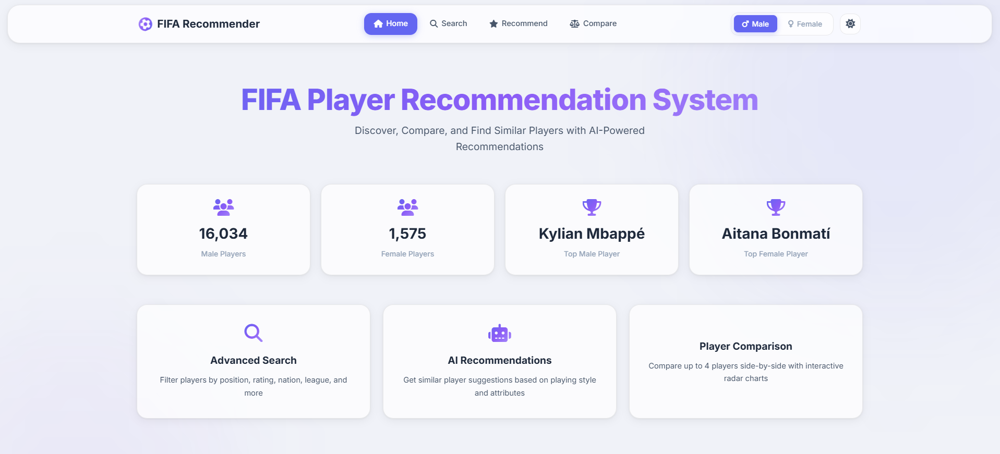
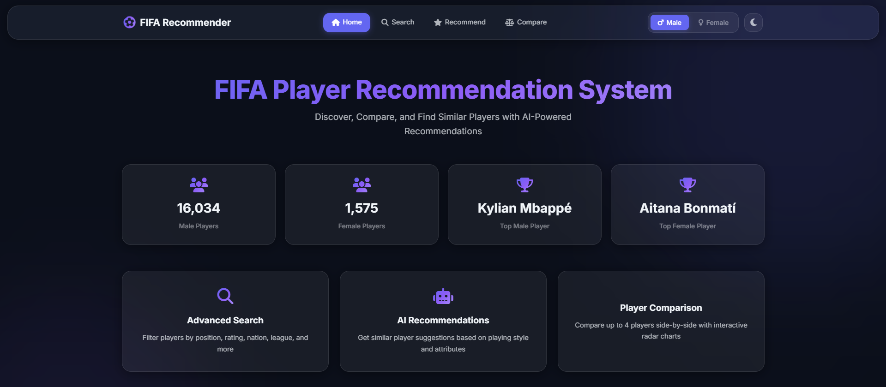
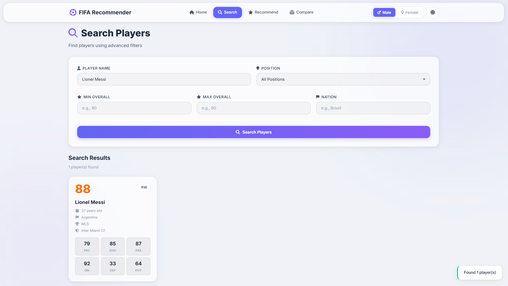
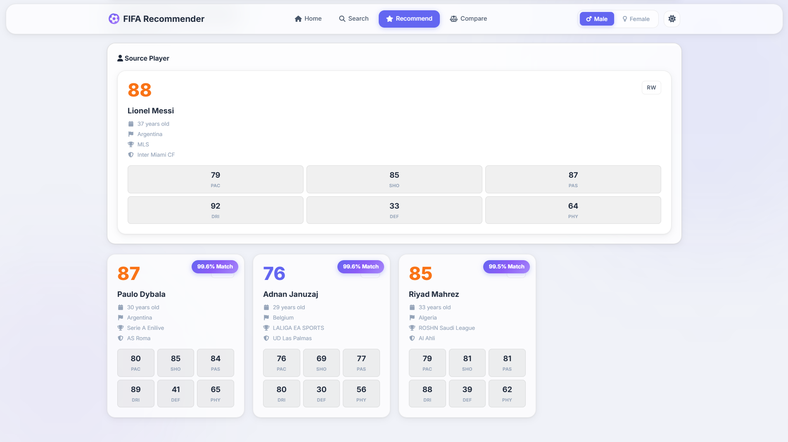
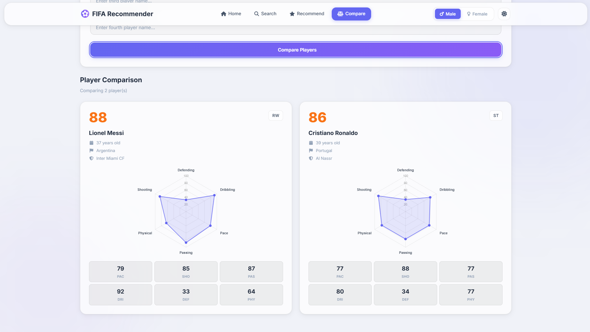
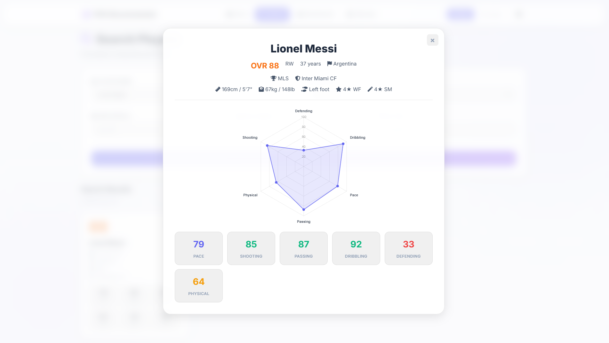

# ⚽ FIFA Player Recommendation System

[](https://www.python.org/)
[](https://flask.palletsprojects.com/)
[](LICENSE)

A modern, AI-powered FIFA player recommendation system built with Flask and scikit-learn. Features separate models for male and female players with advanced search, similarity-based recommendations, and interactive player comparisons.

<p align="center">
  
  &nbsp;
  
</p>

<p align="center">
  
  
  
</p>

<p align="center">
  
</p>

## ✨ Features

- 🤖 **AI-Powered Recommendations** - Content-based filtering using cosine similarity on 34+ player attributes
- 👥 **Dual Gender Support** - Separate optimized models for male and female players (FC 25 dataset)
- 🔍 **Advanced Search** - Filter by position, rating, nation, league, team, and more
- 📊 **Player Comparison** - Compare up to 4 players side-by-side with interactive radar charts
- 🎨 **Modern Glassmorphism UI** - Beautiful, minimalistic design with light and dark themes
- ⚡ **Fast & Efficient** - Optimized for datasets up to 20K players with precomputed similarity matrices
- 📱 **Responsive Design** - Works seamlessly on desktop, tablet, and mobile

## 🚀 Quick Start

Get up and running in 5 minutes!

### Prerequisites

- Python 3.8 or higher
- pip (Python package manager)

### Installation

```bash
# 1. Clone the repository
git clone https://github.com/inboxpraveen/FIFA-Player-Recomendation.git
cd FIFA-Player-Recomendation

# 2. Install dependencies
pip install -r requirements.txt

# 3. Train models (~30 seconds)
python training/train.py

# 4. Run the application
python run.py

# 5. Open your browser
# Navigate to: http://localhost:5000
```

That's it! The system is now ready to use.

### Training Options

```bash
# Train both models (default)
python training/train.py

# Train only male model
python training/train.py --male

# Train only female model
python training/train.py --female
```

📖 **For detailed training options, see [training/README.md](training/README.md)**

## 📁 Project Structure

```
FIFA-Player-Recomendation/
├── app/                          # Flask web application
│   ├── main.py                   # Flask app with API endpoints
│   ├── static/
│   │   ├── css/
│   │   │   └── style.css         # Modern glassmorphism styles
│   │   └── js/
│   │       └── app.js            # Frontend JavaScript logic
│   └── templates/
│       └── index.html            # Main HTML template
│
├── src/                          # Core recommendation system
│   ├── data_processing.py        # Data loading and preprocessing
│   ├── model.py                  # Recommendation model (PlayerRecommender)
│   └── utils.py                  # Helper utilities
│
├── training/                     # Model training
│   ├── train.py                  # Training script
│   └── README.md                 # Training guide
│
├── models/                       # Trained models (generated)
│   ├── male_model.pkl            # Male players model
│   └── female_model.pkl          # Female players model
│
├── new-data/                     # FC 25 player datasets
│   ├── male_players.csv          # ~16K male players
│   └── female_players.csv        # ~1.5K female players
│
├── run.py                        # Application launcher
├── requirements.txt              # Python dependencies
├── README.md                     # This file (you are here)
├── PROJECT_SUMMARY.md            # Detailed technical documentation
├── INSTALL.md                    # Installation guide
└── CONTRIBUTING.md               # Contribution guidelines
```

## 🎮 How to Use

### 1. Search Players

- Enter player name, position, rating range, or nationality
- Filter by multiple criteria simultaneously
- View player cards with key statistics

### 2. Get Recommendations

- Enter a player's name
- Get AI-powered similar player suggestions
- Filter by same position or age range
- See similarity percentage for each recommendation

### 3. Compare Players

- Enter 2-4 player names
- View side-by-side comparison
- Interactive radar charts showing attributes
- Compare stats across all major categories

### 4. Switch Gender

- Toggle between male and female players
- Models are optimized separately for best accuracy
- All features work seamlessly with both datasets

## 🧠 How It Works

The recommendation system uses **content-based filtering** with the following approach:

1. **Feature Extraction**: 34 player attributes (Pace, Shooting, Passing, Dribbling, Defending, Physical, and their sub-attributes)
2. **Normalization**: Min-max normalization for fair comparison across attributes
3. **Similarity Calculation**: Cosine similarity on normalized feature vectors
4. **Precomputation**: Similarity matrix computed once during training for fast inference
5. **Filtering**: Optional position-based and age-based filtering

**Time Complexity**: O(1) for recommendations after precomputation  
**Space Complexity**: O(n²) for similarity matrix, where n is number of players

## 📊 Dataset Information

The project uses FC 25 (FIFA 25) player data:

- **Male Players**: ~16,000 players
- **Female Players**: ~1,500 players
- **Source**: EA Sports FC 25
- **Attributes**: 50+ attributes including ratings, positions, physical stats, and play styles

### Key Attributes

- **Main Stats**: Overall (OVR), PAC, SHO, PAS, DRI, DEF, PHY
- **Detailed Stats**: Acceleration, Sprint Speed, Finishing, Positioning, Vision, Ball Control, and 28 more
- **Info**: Name, Position, Age, Nation, League, Team, Height, Weight
- **Skills**: Weak Foot, Skill Moves, Preferred Foot, Play Style

## 🛠️ Technology Stack

- **Backend**: Flask 3.0 (Python web framework)
- **ML/AI**: scikit-learn (cosine similarity), NumPy, Pandas
- **Frontend**: HTML5, CSS3 (Glassmorphism), Vanilla JavaScript
- **Charts**: Chart.js (radar charts)
- **Icons**: Font Awesome 6
- **Fonts**: Inter (Google Fonts)

## 🎨 Design Philosophy

- **Glassmorphism**: Modern, translucent UI elements with backdrop blur
- **Themes**: Light and dark appearance options
- **Minimalist**: Focus on content, reduce visual noise
- **Responsive**: Mobile-first design approach
- **Accessible**: High contrast, readable fonts, clear navigation

## 📈 Performance

- **Search**: < 100ms for 20K players
- **Recommendations**: < 50ms (precomputed similarity)
- **Comparison**: < 10ms per player
- **Model Loading**: ~2-3 seconds on startup

## 🤝 Contributing

Contributions are welcome! Please feel free to submit a Pull Request.

1. Fork the repository
2. Create your feature branch (`git checkout -b feature/AmazingFeature`)
3. Commit your changes (`git commit -m 'Add some AmazingFeature'`)
4. Push to the branch (`git push origin feature/AmazingFeature`)
5. Open a Pull Request

## 📝 License

This project is licensed under the MIT License - see the [LICENSE](LICENSE) file for details.

## 👨‍💻 Author

**Praveen Kumar**

- Portfolio: [inboxpraveen.github.io](https://inboxpraveen.github.io/)
- GitHub: [@inboxpraveen](https://github.com/inboxpraveen)
- LinkedIn: [praveen-kumar-inbox](https://www.linkedin.com/in/praveen-kumar-inbox/)
- Twitter: [@InboxPraveen](https://twitter.com/InboxPraveen)

## 🙏 Acknowledgments

- EA Sports for FIFA/FC player data
- The open-source community for amazing libraries
- All contributors and supporters of this project

## 📚 Documentation

- **[INSTALL.md](INSTALL.md)** - Detailed installation instructions
- **[training/README.md](training/README.md)** - Complete training guide
- **[PROJECT_SUMMARY.md](PROJECT_SUMMARY.md)** - Technical documentation & API reference
- **[CONTRIBUTING.md](CONTRIBUTING.md)** - How to contribute

---

**⭐ If you find this project helpful, please give it a star!**
